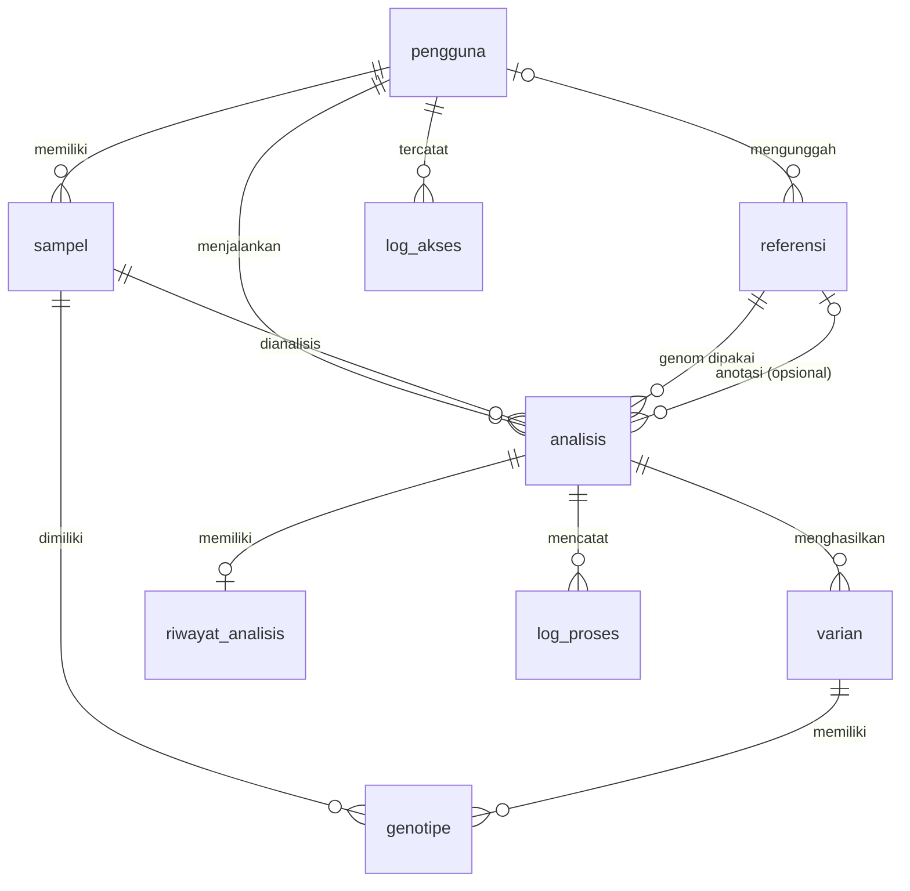

# Database Human GVC

Skema basis data PostgreSQL untuk **Human GVC** (Automated Web-Based Variant Calling Platform), Kelompok 03 GenoSys.

Dokumen ini menjelaskan isi folder `database/`, cara menjalankannya, dan fungsi tiap tabel. Seluruh skema berada dalam **satu berkas**, `01_schema.sql`. Pekerjaan ini merupakan bagian dari Issue #7 (Skema basis data PostgreSQL).

## Prinsip desain

- **Berkas besar tidak disimpan di database.** FASTQ, BAM, dan VCF berada di Storage (mis. AWS S3). Database hanya menyimpan **lokasinya** (path atau S3 key), sesuai pembagian Database dan Storage pada Desain Modular.
- **Satu analisis, satu jejak lengkap.** Parameter, referensi, sampel, status, hasil varian, dan riwayat tersimpan bersama sehingga setiap analisis dapat ditelusuri dan direproduksi.
- **Aturan bisnis ditegakkan di database** lewat constraint dan trigger, bukan hanya di aplikasi.
- Rujukan utama: SKPL Bab 8 Tabel 7 (entitas data), Desain Modular Bab 2 dan Bab 6, wireframe UC-01 s.d. UC-07.

## Isi folder

| Berkas | Fungsi |
|---|---|
| `01_schema.sql` | Membuat 9 tabel (8 entitas SKPL Tabel 7 + `log_proses`), constraint, trigger, dan indeks |

Berkas ini hanya berisi **skema**. Tidak ada data awal maupun data contoh. Seluruh skrip berjalan dalam **satu transaksi** (`BEGIN` ... `COMMIT`): jika ada error, tidak ada tabel yang tersisa setengah jadi.

## Prasyarat

- PostgreSQL 13 atau lebih baru (skrip diuji pada PostgreSQL 16)

## Cara menjalankan

Buat database kosong, lalu jalankan satu berkas:

```bash
psql -U postgres -c "CREATE DATABASE human_gvc;"
psql -U postgres -d human_gvc -v ON_ERROR_STOP=1 -f database/01_schema.sql
```

Skrip ini dirancang untuk **database kosong**. Menjalankannya dua kali akan gagal dengan pesan `relation "pengguna" already exists` (dan tidak meninggalkan perubahan apa pun). Untuk mengulang dari awal, gunakan langkah reset di bawah.

Cek hasilnya di psql:

```sql
\dt                      -- daftar tabel (harus 9)
\d analisis              -- struktur tabel beserta constraint
\di                      -- daftar indeks
```

Jika memakai pgAdmin: buat database `human_gvc`, buka **Tools > Query Tool**, paste seluruh isi `01_schema.sql`, lalu tekan **F5**.

### Reset database

Perintah ini **menghapus semua data**:

```sql
DROP SCHEMA public CASCADE;
CREATE SCHEMA public;
```

Setelah itu jalankan ulang `01_schema.sql`.

## Relasi antartabel



ERD lengkap dengan seluruh kolom tersedia pada berkas `ERD_Human_GVC.png` (atau kode DBML untuk dbdiagram.io).

## Ringkasan tabel

| No | Tabel | Fungsi | Use case terkait |
|---|---|---|---|
| 1 | `pengguna` | Akun peneliti dan administrator | UC-07 |
| 2 | `sampel` | Metadata sampel dan lokasi berkas FASTQ | UC-01 |
| 3 | `referensi` | Genom referensi (FASTA) dan basis data anotasi | UC-02, UC-07 |
| 4 | `analisis` | Konfigurasi, parameter, status, progres, penguncian, publikasi | UC-02, UC-03, UC-04 |
| 5 | `varian` | Hasil varian (kromosom, posisi, REF, ALT, kualitas) | UC-05, UC-06 |
| 6 | `genotipe` | Genotipe, kedalaman, dan kualitas per varian dan sampel | UC-05 |
| 7 | `riwayat_analisis` | Waktu proses, masa retensi, lokasi berkas hasil | UC-05 |
| 8 | `log_akses` | Jejak akses pengguna terhadap data dan hasil | Semua UC |
| 9 | `log_proses` | Log proses per baris selama analisis (tabel tambahan) | UC-04 |

Pada tabel di bawah, kolom bertanda **(+)** adalah kolom tambahan di luar atribut utama SKPL Tabel 7. Kolom tersebut ditambahkan karena dibutuhkan oleh use case, aturan bisnis, atau wireframe.

## Detail tabel

### 1. `pengguna`

Akun yang dapat masuk ke sistem.

| Kolom | Tipe | Keterangan |
|---|---|---|
| `id_pengguna` | integer, PK | Identity otomatis |
| `nama` | varchar(150) | Wajib |
| `email` | varchar(255) | Wajib, **UNIQUE** |
| `password_hash` (+) | text | Hash bcrypt, bukan kata sandi asli |
| `peran` (+) | varchar(20) | `peneliti` atau `administrator` (default `peneliti`) |
| `aktif` (+) | boolean | Akun dinonaktifkan, bukan dihapus, agar jejak `log_akses` tetap utuh |
| `dibuat_pada` (+) | timestamptz | Otomatis terisi |

### 2. `sampel`

Metadata sampel beserta lokasi berkas FASTQ.

| Kolom | Tipe | Keterangan |
|---|---|---|
| `id_sampel` | integer, PK | |
| `id_pengguna` | integer, FK | Pemilik sampel (`ON DELETE RESTRICT`) |
| `nama_sampel` | varchar(150) | |
| `lokasi` | varchar(255) | Lokasi pengambilan sampel |
| `strain` | varchar(100) | |
| `karakteristik` | text | |
| `tipe_baca` (+) | varchar(12) | `paired-end` atau `single-end` |
| `lokasi_fastq_r1` (+) | text | Path atau S3 key FASTQ R1 |
| `lokasi_fastq_r2` (+) | text | Wajib terisi jika `paired-end` (BR-03) |
| `dibuat_pada` (+) | timestamptz | |

### 3. `referensi`

Menampung genom referensi dan basis data anotasi dalam satu tabel, dibedakan kolom `jenis`.

| Kolom | Tipe | Keterangan |
|---|---|---|
| `id_referensi` | integer, PK | |
| `nama_referensi` | varchar(200) | |
| `status` | varchar(10) | `bawaan` atau `unggahan` |
| `jenis` (+) | varchar(10) | `genom` atau `anotasi` (default `genom`) |
| `lokasi_berkas` (+) | text | Path atau S3 key |
| `id_pengunggah` (+) | integer, FK | Kosong untuk referensi bawaan (`ON DELETE SET NULL`) |
| `dibuat_pada` (+) | timestamptz | |

### 4. `analisis`

Tabel pusat. Satu baris mewakili satu konfigurasi dan eksekusi analisis.

| Kolom | Tipe | Keterangan |
|---|---|---|
| `id_analisis` | integer, PK | |
| `id_pengguna` | integer, FK | Pemilik analisis |
| `id_sampel` (+) | integer, FK | Boleh kosong hanya jika status `draf` |
| `id_referensi` | integer, FK | Genom referensi yang dipakai; boleh kosong hanya jika `draf` |
| `id_referensi_anotasi` (+) | integer, FK | Basis data anotasi (opsional) |
| `tanggal` | timestamptz | |
| `status` | varchar(10) | `draf`, `menunggu`, `berjalan`, `selesai`, `gagal` |
| `parameter` | jsonb | Default: `{"kualitas_pemangkasan_min":20,"kedalaman_min":10,"qual_min":30}` |
| `tahap_saat_ini` (+) | varchar(30) | `qc_trimming`, `alignment`, `bam_processing`, `variant_calling`, `filtering`, `anotasi` |
| `progres_persen` (+) | smallint | 0 sampai 100 |
| `log_kesalahan` (+) | text | Ringkasan penyebab gagal |
| `keterangan` (+) | text | Mis. "anotasi dilewati" |
| `terkunci` (+) | boolean | Hasil terkunci tidak dapat diubah (BR-05) |
| `dipublikasikan` (+) | boolean | Masuk ke basis data varian bersama (BR-06) |

> Nilai default parameter (Q20, depth 10, QUAL 30) adalah placeholder umum. SKPL tidak menetapkan angka, sesuaikan dengan klien.

### 5. `varian`

Hasil varian dari analisis yang berhasil.

| Kolom | Tipe | Keterangan |
|---|---|---|
| `id_varian` | bigint, PK | |
| `id_analisis` | integer, FK | `ON DELETE CASCADE` |
| `kromosom` | varchar(20) | |
| `posisi` | bigint | Harus > 0 |
| `ref` | text | Basa referensi |
| `alt` | text | Basa alternatif |
| `quality_score` | numeric(10,2) | Harus >= 0 |
| `gen` (+) | varchar(100) | Dari anotasi (opsional), untuk pencarian UC-06 |

Kombinasi `(id_analisis, kromosom, posisi, ref, alt)` bersifat **UNIQUE** sehingga impor varian dapat diulang tanpa duplikasi.

### 6. `genotipe`

Genotipe per varian per sampel.

| Kolom | Tipe | Keterangan |
|---|---|---|
| `id_genotipe` | bigint, PK | |
| `id_varian` | bigint, FK | `ON DELETE CASCADE` |
| `id_sampel` (+) | integer, FK | Mengaitkan genotipe dengan sampel |
| `genotipe` | varchar(20) | Contoh: `0/1`, `1/1`, `0\|1` |
| `kedalaman` | integer | Harus >= 0 |
| `kualitas_genotipe` | numeric(10,2) | Harus >= 0 |

Kombinasi `(id_varian, id_sampel)` bersifat **UNIQUE**.

### 7. `riwayat_analisis`

Riwayat satu analisis (satu analisis paling banyak satu riwayat).

| Kolom | Tipe | Keterangan |
|---|---|---|
| `id_riwayat` | integer, PK | |
| `id_analisis` | integer, FK, UNIQUE | `ON DELETE CASCADE` |
| `tanggal` | timestamptz | |
| `waktu_proses_detik` | integer | Lama proses dalam detik |
| `masa_retensi_hari` | integer | Default 90 (BR-08); harus > 0 |
| `lokasi_hasil_vcf` | text | Lokasi berkas hasil VCF |
| `lokasi_hasil_csv` | text | Lokasi berkas hasil CSV |

Query untuk mencari riwayat yang melewati masa retensi (dijalankan job terjadwal):

```sql
SELECT id_analisis FROM riwayat_analisis
WHERE tanggal + masa_retensi_hari * INTERVAL '1 day' < now();
```

Job penghapusan juga harus menghapus berkas hasilnya di Storage.

### 8. `log_akses`

Jejak akses pengguna terhadap data dan hasil analisis (FR-13, NFR-03).

| Kolom | Tipe | Keterangan |
|---|---|---|
| `id_log` | bigint, PK | |
| `waktu` | timestamptz | Otomatis terisi |
| `id_pengguna` | integer, FK | `ON DELETE RESTRICT` |
| `jenis_objek` | varchar(20) | `sampel`, `analisis`, `varian`, `referensi`, `akun` |
| `id_objek` | bigint | ID pada tabel sesuai `jenis_objek` |
| `jenis_aksi` | varchar(20) | `login`, `lihat`, `unggah`, `ubah`, `hapus`, `jalankan`, `unduh`, `cari` |

`id_objek` sengaja **tidak memiliki foreign key** karena menunjuk ke tabel yang berbeda bergantung pada `jenis_objek`.

### 9. `log_proses` (tabel tambahan)

Didefinisikan pada `01_schema.sql`. Menyimpan catatan proses per baris untuk panel log kronologis pada UC-04 (FR-07, NFR-08).

| Kolom | Tipe | Keterangan |
|---|---|---|
| `id_log_proses` | bigint, PK | Dipakai untuk polling log baru |
| `id_analisis` | integer, FK | `ON DELETE CASCADE` |
| `waktu` | timestamptz | |
| `tahap` | varchar(30) | Tahap pipeline; boleh kosong untuk pesan umum |
| `jenis_pesan` | varchar(10) | `info`, `berjalan`, `berhasil`, `error` |
| `pesan` | text | Isi catatan |

Contoh mengambil log untuk halaman pemantauan:

```sql
SELECT waktu, tahap, jenis_pesan, pesan
FROM log_proses
WHERE id_analisis = 1
ORDER BY waktu;
```

## Aturan bisnis di level database

| Aturan | Mekanisme | Efek |
|---|---|---|
| BR-01 | Constraint `ck_analisis_lengkap` | Analisis selain `draf` wajib punya sampel dan referensi |
| BR-03 | Constraint `ck_sampel_paired` | Sampel `paired-end` wajib punya `lokasi_fastq_r2` |
| BR-05 | Constraint `ck_analisis_terkunci` dan trigger `trg_analisis_terkunci` | Hanya analisis `selesai` yang bisa dikunci; analisis terkunci tidak bisa diubah parameter, sampel, referensi, atau statusnya |
| BR-06 | Constraint `ck_analisis_publikasi` | Analisis `gagal` atau tidak lengkap tidak bisa dipublikasikan |
| BR-08 | Kolom `masa_retensi_hari` | Dasar penghapusan otomatis oleh job terjadwal |

Aturan yang **belum** di database:
- **BR-04** (rentang parameter): divalidasi di backend (FastAPI/Pydantic) agar pesan kesalahannya jelas.
- **BR-02** (format berkas didukung): divalidasi di backend saat unggah.
- **BR-07** (riwayat hanya milik sendiri): dijaga di lapisan API dengan memfilter `id_pengguna`.

## Indeks

| Indeks | Kolom | Tujuan |
|---|---|---|
| `idx_sampel_pengguna` | `sampel(id_pengguna)` | Daftar sampel per pengguna |
| `idx_analisis_pengguna` | `analisis(id_pengguna, tanggal DESC)` | Riwayat analisis pengguna |
| `idx_analisis_status` | `analisis(status)` | Filter analisis berdasarkan status |
| `idx_varian_analisis` | `varian(id_analisis)` | Tabel hasil per analisis |
| `idx_varian_lokus` | `varian(kromosom, posisi)` | Pencarian lokus (UC-06) |
| `idx_varian_quality` | `varian(quality_score)` | Filter kualitas (UC-06) |
| `idx_varian_gen` | `varian(gen)` | Pencarian berdasarkan gen (UC-06) |
| `idx_genotipe_varian` | `genotipe(id_varian)` | Detail genotipe per varian |
| `idx_log_pengguna_waktu` | `log_akses(id_pengguna, waktu DESC)` | Riwayat akses per pengguna |
| `idx_log_objek` | `log_akses(jenis_objek, id_objek)` | Riwayat akses per objek |
| `idx_log_proses_analisis` | `log_proses(id_analisis, waktu)` | Panel log per analisis |

## Perilaku penghapusan (ON DELETE)

| Relasi | Aturan | Alasan |
|---|---|---|
| `pengguna` ke `sampel`, `analisis`, `log_akses` | `RESTRICT` | Pengguna yang punya data tidak bisa dihapus; gunakan `aktif = FALSE` |
| `sampel` dan `referensi` ke `analisis` | `RESTRICT` | Data yang dipakai analisis tidak boleh hilang |
| `referensi.id_pengunggah` | `SET NULL` | Referensi tetap ada meski akun pengunggah dihapus |
| `analisis` ke `varian`, `riwayat_analisis`, `log_proses` | `CASCADE` | Data turunan ikut terhapus bersama analisisnya |
| `varian` ke `genotipe` | `CASCADE` | Genotipe ikut terhapus bersama variannya |

## Anggota Kelompok 03 GenoSys

Dhafin Fasya Arifin, Rakazaki Putra Hendrawan, Yafits Mubarak, Muhammad Fattha Akbarsyah, Abid Ra'fad Aziz.
